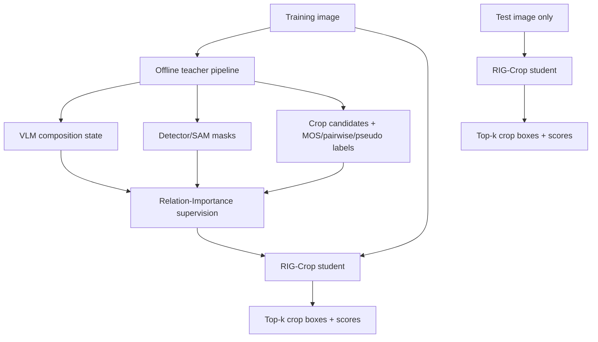

# DACC 中间态数据利用与 Image-only Student 方案调研

日期：2026-06-22  
目标：把现有 VLM/GAICD 中间态数据整理成一个更适合 AAAI/CVPR 投稿叙事的 student 训练方案。  
核心约束：**推理时输入只有一张图片**；VLM、SAM、检测器、中间态 JSON 只在离线数据构建和训练监督中使用。

---

## 1. 一句话结论

当前最合理的方案不是让小模型在推理时读取 VLM 生成的 `entities/relations/importance`，也不是让小模型从零学习开放类别检测，而是：

> 用 VLM 中间态作为训练时的结构化 teacher supervision，让 student 从单张图片中学习一个 latent composition graph，再用这个隐式图完成 crop ranking 或 top-k crop generation。

推荐论文主线：

```text
Can an image-only cropper learn latent composition reasoning from VLM-distilled
entity importance and inter-entity relation supervision?
```

推荐方法名暂定：

```text
RIG-Crop: Relation-Importance Guided Image Cropping
```

---

## 2. 现有顶会方法调研

### 2.1 Candidate ranking 与 dense crop supervision

#### CPC / Good View Hunting, CVPR 2018

论文：[Good View Hunting: Learning Photo Composition from Dense View Pairs](https://openaccess.thecvf.com/content_cvpr_2018/html/Wei_Good_View_Hunting_CVPR_2018_paper.html)

核心思想：

- 构建 Comparative Photo Composition dataset。
- 每张图生成多个 candidate views。
- 人工标注 pairwise preference，而不是单个绝对分数。
- 用 view pair 学习 view ranking / view proposal。

对本项目的启发：

- 裁剪天然适合 pairwise ranking，不一定要强行回归一个唯一 crop。
- 你的中间态可以转成 pairwise reason：`crop A` 比 `crop B` 好，因为它保留了更高 importance 的主体或关系。

局限：

- 没有显式主体 importance。
- 没有 typed relation。
- 没有说明为什么一个主体或关系应该被保留。

#### GAIC / GAICD, CVPR 2019

论文：[Reliable and Efficient Image Cropping: A Grid Anchor Based Approach](https://openaccess.thecvf.com/content_CVPR_2019/html/Zeng_Reliable_and_Efficient_Image_Cropping_A_Grid_Anchor_Based_Approach_CVPR_2019_paper.html)

核心思想：

- 把 image cropping 变成 grid anchor candidate scoring。
- 每张图少于 100 个候选框，所有候选框都有人工 MOS。
- 同时考虑 RoI 与 RoD，即保留区域和丢弃区域。

对本项目的启发：

- GAICD 的 MOS 是你最可靠的 crop quality supervision。
- VLM 不应该覆盖 GAICD 的人工 MOS，而应该补充解释性中间态。
- 最稳第一版 student 应先走 internal anchor scoring，而不是直接自由回归 box。

局限：

- GAICD 图像数量小。
- RoI/RoD 是视觉和几何层面的，语义关系不足。
- 不能表达“裁掉的是干扰物还是关键关系物”。

### 2.2 显式构图规则、关系与空间建模

#### Image Cropping with Composition and Saliency Aware Aesthetic Score Map, AAAI 2020

论文：[AAAI 2020 页面](https://ojs.aaai.org/index.php/AAAI/article/view/6889)

核心思想：

- 生成 composition-aware 与 saliency-aware aesthetic score map。
- 同一图像区域在不同 crop 内的相对位置不同，因此美学分数也不同。

对本项目的启发：

- 仅有 saliency 不够，位置和构图上下文会改变区域价值。
- 你的 `importance` 不能被写成 saliency 的同义词，必须强调语义角色和裁剪取舍。

局限：

- 重要性更多来自 saliency/composition score map。
- 没有 VLM 语义角色，也没有主体间 typed relation。

#### Composing Good Shots by Exploiting Mutual Relations, CVPR 2020

论文：[CVPR 2020 页面](https://openaccess.thecvf.com/content_CVPR_2020/html/Li_Composing_Good_Shots_by_Exploiting_Mutual_Relations_CVPR_2020_paper.html)

核心思想：

- 候选 crop 之间不是独立的。
- 用 graph module 建模不同 candidate regions 之间的 mutual relation。
- 通过 gated feature update 在候选图上传播信息。

对本项目的启发：

- “关系”已经是裁剪领域的已有方向，不能只说“我们考虑关系”。
- 你的差异必须是：关系不是隐式 candidate graph，而是来自 VLM 中间态的 `entity role + importance + relation policy`。

局限：

- 关系主要发生在候选 region/candidate 之间。
- 不是显式的 `person-holding-camera` 或 `person-dog-must_keep_together` 关系。

#### Composing Photos Like a Photographer, CVPR 2021

论文：[CVPR 2021 页面](https://openaccess.thecvf.com/content/CVPR2021/html/Hong_Composing_Photos_Like_a_Photographer_CVPR_2021_paper.html)

核心思想：

- 提出 Key Composition Map, KCM。
- 显式建模摄影构图规则，而不是只隐式 ranking。

对本项目的启发：

- 顶会已经认可“显式构图知识”对裁剪有价值。
- 你的中间态可以被定位为比 KCM 更语义化的 composition state。

局限：

- 主要编码构图规则，不强调 instance-level importance 与 inter-entity relation。

#### TransView, ICCV 2021

论文：[TransView: Inside, Outside, and Across the Cropping View Boundaries](https://openaccess.thecvf.com/content/ICCV2021/html/Pan_TransView_Inside_Outside_and_Across_the_Cropping_View_Boundaries_ICCV_2021_paper.html)

核心思想：

- 视觉元素之间的 attraction / repulsion 会影响它们相对 crop boundary 的位置。
- 用 transformer 表示 visual words 并建模 crop 内、crop 外和 crop boundary across 的依赖。

对本项目的启发：

- 关系保留不只是“都在框里”，还包括 crop boundary 是否切断关系。
- 你的 `relation_preservation` 应该是 crop-conditioned，而不是全图静态关系。

局限：

- 关系依然是视觉元素间的隐式依赖。
- 没有 VLM 产生的语义 relation type / relation importance / crop policy。

#### Rethinking Image Cropping, CVPR 2022

论文：[Rethinking Image Cropping: Exploring Diverse Compositions From Global Views](https://openaccess.thecvf.com/content/CVPR2022/html/Jia_Rethinking_Image_Cropping_Exploring_Diverse_Compositions_From_Global_Views_CVPR_2022_paper.html)

核心思想：

- 将 image cropping 看成 set prediction。
- 多个 learnable anchors 回归一组 crop，解决 anchor 方法全局性不足和 regression 方法多样性不足。

对本项目的启发：

- 最终模型输出应是 top-k crops，而不是唯一 crop。
- 可以先做 internal anchor ranker，再升级为 DETR-style crop queries。

局限：

- 主要解决多样 crop 生成。
- 不解释主体 importance 和关系为什么影响 crop。

#### Spatial-Aware Feature and Rank Consistency, CVPR 2023

论文：[CVPR 2023 页面](https://openaccess.thecvf.com/content/CVPR2023/html/Wang_Image_Cropping_With_Spatial-Aware_Feature_and_Rank_Consistency_CVPR_2023_paper.html)

核心思想：

- 显式编码 candidate crop 与 aesthetic elements 的空间关系。
- 用 pairwise ranking classifier，把标注数据上的 rank knowledge 迁移到未标注数据，增强 rank consistency。

对本项目的启发：

- crop 与 aesthetic elements 的相对空间关系是强监督。
- 你可以把 aesthetic elements 升级为 VLM-distilled entities/relations。

局限：

- aesthetic elements 偏视觉/显著性。
- 语义 importance、关系类型和关系破坏风险仍不足。

#### S2CNet, AAAI 2024

论文：[Spatial-Semantic Collaborative Cropping for User Generated Content](https://ojs.aaai.org/index.php/AAAI/article/view/28303)

核心思想：

- 面向 UGC 图像，强调复杂背景和多物体关系。
- 提出 Spatial-Semantic Collaborative cropping network。
- 用 adaptive attention graph 在 visual nodes 上传播信息，把 spatial/semantic relation 聚合到 crop candidate。
- 提出 UGCrop5K benchmark。

对本项目的关键影响：

- 这篇是最接近你“多主体关系”想法的强相关工作。
- 因此论文不能只写“我们建图、我们利用主体关系”，否则会被认为是 S2CNet 的增量变体。

你的差异应写成：

```text
S2CNet learns implicit visual-node relations for UGC crop candidates.
RIG-Crop distills VLM-generated role, importance, typed relation, and crop policy
as explicit training supervision, but remains image-only at inference.
```

### 2.3 Subject-aware / Human-centric / 弱监督数据

#### Human-centric Image Cropping, ECCV 2022

论文：[arXiv 页面](https://arxiv.org/abs/2207.10269)，[官方代码](https://github.com/bcmi/Human-Centric-Image-Cropping)

核心思想：

- 面向人像裁剪。
- 使用 human bbox，把区域按人体位置分区。
- 设计 partition-aware feature 和 content-preserving feature。

对本项目的启发：

- subject 的空间位置、完整性、周围 context 对裁剪很重要。
- 但只做人类 subject 会限制泛化。

你的差异：

- 不限于 human-centric。
- subject 可以是人、物体、动物、环境关系。
- 不只保留主体，还保留高 importance 的主体间关系。

#### GenCrop, AAAI 2024

论文：[Learning Subject-Aware Cropping by Outpainting Professional Photos](https://arxiv.org/html/2312.12080v2)

核心思想：

- 专业 stock image 被视为 good crop。
- 用 diffusion outpainting 生成 uncropped/cropped training pairs。
- 训练 subject-aware cropper，弱监督但不需要人工 crop 标注。

对本项目的启发：

- 大规模数据可以通过 professional photo + outpainting 构造。
- 但 GenCrop 更偏 subject-aware 和 cropped/uncropped pair，不提供 relation/importance/policy 中间态。

你的差异：

- 不主打 outpainting 数据构造。
- 主打 VLM-distilled composition state，尤其是 entity importance 和 relation policy。

#### ProCrop, AAAI 2026

论文：[AAAI OJS 页面](https://ojs.aaai.org/index.php/AAAI/article/view/38255)，项目页：[ProCrop](https://bwgzk-keke.github.io/ProCrop/)，预印本：[arXiv HTML](https://arxiv.org/html/2505.22490v1)

核心思想：

- 从专业图片检索相似 composition reference。
- 用 outpainting 和 iterative refinement 构建大规模弱监督数据。
- 项目页报告约 242K weakly annotated images。

对本项目的启发：

- 大规模弱监督 crop 数据已经成为趋势。
- ProCrop 更强调 professional composition retrieval 和 layout similarity。

你的差异：

- 不是检索专业构图，而是学习 VLM 中间态中的语义取舍：谁重要、谁和谁必须一起保留、哪些区域可丢弃。
- ProCrop 可作为预训练数据源，而不是核心创新替代品。

### 2.4 VLM / MLLM cropping

#### Cropper, CVPR 2025

论文：[Cropper: Vision-Language Model for Image Cropping through In-Context Learning](https://arxiv.org/abs/2408.07790)

核心思想：

- 用 VLM 的 visual in-context learning 做裁剪。
- 通过 prompt retrieval 选择 in-context examples。
- 迭代优化 crop。
- 支持 free-form、subject-aware、aspect-ratio-aware cropping。

对本项目的启发：

- “用 VLM 做裁剪”已经不是空白。
- 如果推理时依赖 VLM，容易和 Cropper 正面对撞。

你的差异：

- VLM 只做离线 teacher。
- Student 推理不调用 VLM，只输入图片。
- 核心贡献是 structured distillation，而不是 VLM prompting。

#### CROP, arXiv 2026

论文：[CROP: Expert-Aligned Image Cropping via Compositional Reasoning and Optimizing Preference](https://arxiv.org/abs/2605.12545)

核心思想：

- 将 aesthetic cropping 重构成 multimodal reasoning task。
- VLM 按 analysis-proposal-decision 流程模拟摄影师。
- 用 preference alignment 对齐专家审美。

对本项目的启发：

- VLM reasoning for cropping 已经开始被系统化。
- 你的中间态可被定位为把 VLM reasoning 压缩成可训练的 latent supervision。

你的差异：

- 不让 VLM 在推理阶段一步步 reasoning。
- 让 image-only student 学出隐式构图推理。

---

## 3. 研究空缺与本项目可切入点

### 3.1 已经被占据的点

下面这些不能作为唯一创新点：

```text
1. 用候选框 ranking 做裁剪
2. 用 dense MOS 或 pairwise preference 监督裁剪
3. 用 saliency / composition map 表示重要区域
4. 用 graph / transformer 建模 crop 内外关系
5. 用 VLM 直接做裁剪
6. 用 professional photos / outpainting 扩数据
```

### 3.2 仍然有空间的点

你的中间态最有价值的不是 caption，而是这些结构化字段：

```text
entity role
entity importance
inter-entity relation
relation importance
crop policy
issue/action
distractor / environment role
```

它们可以形成一个比 saliency、binary subject mask、implicit graph 更强的 supervision：

```text
不是“哪里显著”，而是“谁在构图上重要”；
不是“两个区域有视觉关系”，而是“这段关系是否必须被 crop 保留”；
不是“VLM 给出一个裁剪框”，而是“VLM 解释裁剪取舍，student 学会这种取舍”。
```

---

## 4. 总体方案：训练时中间态监督，推理时 image-only

### 4.1 总流程



### 4.2 训练时与推理时的区别

| 阶段 | 模型 forward 输入 | 训练监督/额外文件 | 输出 |
|---|---|---|---|
| 离线数据构建 | image + dataset annotations | VLM、detector、SAM、GAICD/CPC/SACD/ProCrop labels | middle-state JSONL |
| student 训练 | **image** | crop label、entity/importance/relation teacher、candidate labels | crop、score、aux latent state |
| student 推理 | **image only** | 无 VLM、无 SAM、无 detector、无中间态 JSON | top-k crop boxes + scores |

如果业务需要指定比例，有两种写法：

```text
严格 image-only 论文设置：
  输入一张图片，输出多个常见比例或自由比例 top-k crops。

工程设置：
  输入 image + target_aspect_ratio。
  target_aspect_ratio 是任务条件，不是语义中间态；但如果你想坚持“只有图片”，论文主实验先不加这个条件。
```

---

## 5. 中间态数据应该标准化成什么

当前项目已有：

- `vlm_understanding.main_subject.importance`
- `key_objects[*].importance`
- `important_background`
- `distractors`
- `composition_intent`
- `crop_state_graph`
- `candidates[*].features`
- `candidates[*].scores`

建议升级为统一的 `composition_state`：

```json
{
  "entities": [
    {
      "id": "e1",
      "name": "woman",
      "role": "main_subject",
      "bbox_norm": [0.16, 0.09, 0.51, 0.96],
      "mask_ref": "optional_mask_id",
      "importance": 0.95,
      "confidence": 0.85,
      "source": "vlm+detector"
    },
    {
      "id": "e2",
      "name": "camera",
      "role": "key_object",
      "bbox_norm": [0.34, 0.34, 0.43, 0.46],
      "importance": 0.80,
      "confidence": 0.80,
      "source": "vlm"
    }
  ],
  "relations": [
    {
      "src": "e1",
      "dst": "e2",
      "type": "holding",
      "importance": 0.90,
      "policy": "must_keep_together",
      "region_norm": [0.16, 0.09, 0.51, 0.96],
      "confidence": 0.75
    }
  ],
  "composition_intent": {
    "main_issue": "subject_object_relation_should_be_preserved",
    "suggested_action": "preserve_relation",
    "avoid_cutting": ["head", "hands", "camera"]
  }
}
```

### 5.1 Entity role 小词表

不要训练模型识别开放类别。Student 只需要学裁剪相关角色：

```text
main_subject
secondary_subject
key_object
important_context
distractor
background
unknown
```

### 5.2 Relation policy 比 relation type 更重要

`holding / looking_at / next_to` 有用，但更适合论文和训练的是 crop policy：

```text
must_keep_together      # 人和相机、人和狗、人和球
keep_context            # 主体和环境语境，比如舞台、山峰、夕阳
can_drop                # 可牺牲关系
remove_if_possible      # 主体与干扰物、广告牌、路人
avoid_cutting_path      # 绳子、视线、手持动作、运动方向
```

这能避免 relation type 太散，也降低 VLM 噪声。

---

## 6. Student 设计：RIG-Crop

### 6.1 模型输入输出

#### 训练时

模型 forward 输入：

```text
I: image tensor
```

训练 batch 额外携带监督标签：

```text
Y_crop:
  GAICD MOS / CPC pairwise / SACD ranking / ProCrop pseudo crop

T_entity:
  teacher entity boxes, roles, importance

T_relation:
  teacher relation matrix, relation importance, crop policy

T_action:
  issue/action/violation labels
```

模型输出：

```text
P_crop:
  top-k crop boxes, scores

P_entity:
  N latent entity slots, each with box, role, importance, existence

P_relation:
  N x N relation affinity / importance / policy

P_action:
  optional issue/action logits

P_violation:
  important_entity_cut, relation_break, distractor_kept
```

#### 推理时

输入：

```text
I: image tensor only
```

输出：

```json
{
  "crops": [
    {
      "box": [x1, y1, x2, y2],
      "score": 0.92,
      "rank": 1
    },
    {
      "box": [x1, y1, x2, y2],
      "score": 0.87,
      "rank": 2
    }
  ],
  "optional_debug": {
    "latent_entities": "...",
    "latent_relations": "..."
  }
}
```

`optional_debug` 只用于可视化和论文分析，不作为用户输入。

### 6.2 模型结构

```text
Image
  -> Visual Encoder
  -> Latent Entity Decoder
  -> Latent Relation Module
  -> Internal Crop Candidate / Crop Query Decoder
  -> Crop Scoring and Generation Heads
```

#### Visual Encoder

可选：

```text
Swin-T / ConvNeXt-T / DINOv2 ViT-S / ResNet50
```

建议第一版：

```text
DINOv2 ViT-S 或 Swin-T 预训练 backbone，前几层冻结，后几层微调。
```

原因：

- 10K-50K 裁剪图像不足以从零训练强视觉特征。
- 用预训练 backbone 可把问题集中到 composition reasoning。

#### Latent Entity Decoder

用 `N_e=8` 或 `12` 个 entity queries：

```text
entity_token_i -> {
  box_i,
  role_i,
  importance_i,
  existence_i
}
```

注意：这里不是开放类别检测器。它不预测 `person/dog/camera/flower` 等长尾类别，只预测裁剪相关角色和重要性。

训练监督：

```text
teacher entities -> Hungarian matching -> predicted entity slots
```

损失：

```text
L_entity =
  L1/GIoU(box)
  + CE(role)
  + SmoothL1(importance)
  + BCE(existence)
```

#### Latent Relation Module

对 entity tokens 两两建模：

```text
r_ij = MLP([e_i, e_j, geom_ij])
```

其中 `geom_ij` 包括：

```text
dx, dy, distance, angle, area_ratio, overlap, containment
```

输出：

```text
relation_affinity_ij
relation_importance_ij
relation_policy_ij
```

训练监督来自 VLM 中间态关系：

```text
L_relation =
  BCE(relation_exists)
  + SmoothL1(relation_importance)
  + CE(relation_policy)
```

#### Crop Candidate / Crop Query Decoder

建议分两阶段。

第一阶段：internal anchor ranker

```text
image -> internal GAIC-style anchors -> score each anchor
```

输入仍然是 image only，因为 anchors 是模型内部生成，不由用户输入。

优点：

- 训练稳定。
- 能直接用 GAICD MOS。
- 方便和 GAIC、Spatial-aware、S2CNet 对齐比较。

第二阶段：DETR-style crop generator

```text
image -> K learnable crop queries -> top-k boxes + scores
```

优点：

- 更端到端。
- 更适合最终论文模型。

建议投稿主实验可以把第一阶段作为主模型，第二阶段作为增强或未来工作；如果时间充足再反过来。

### 6.3 Crop-conditioned relation attention

这是方法里最应该强调的模块。

对每个 internal candidate crop `c`，模型计算：

```text
coverage_i(c)
cut_risk_i(c)
relation_region_coverage_ij(c)
post_crop_position_i(c)
distractor_kept(c)
```

关系保留分数：

```text
RelPreserve_ij(c)
= min(coverage_i(c), coverage_j(c)) * relation_region_coverage_ij(c)
```

importance-weighted crop utility：

```text
U(c) =
  sum_i importance_i * coverage_i(c)
  + alpha * sum_ij relation_importance_ij * RelPreserve_ij(c)
  - beta * sum_k distractor_importance_k * coverage_k(c)
```

其中 `importance_i` 和 `relation_importance_ij` 在训练早期可使用 teacher 值，训练后期逐渐切换到 student 预测值。

---

## 7. 训练目标

总损失：

```text
L =
  L_crop
  + lambda_pair * L_pair
  + lambda_entity * L_entity
  + lambda_relation * L_relation
  + lambda_preserve * L_preserve
  + lambda_action * L_action
  + lambda_violation * L_violation
```

### 7.1 Crop quality loss

适用于 GAICD / UGCrop5K / ProCrop pseudo labels：

```text
L_crop = SmoothL1(pred_score(c), normalized_score(c))
```

GAICD：

```text
score = MOS
```

ProCrop：

```text
score = pseudo label quality / model-in-the-loop score
```

### 7.2 Pairwise ranking loss

适用于 CPC / SACD：

```text
L_pair = max(0, margin - s(c_pos) + s(c_neg))
```

或：

```text
L_pair = -log sigmoid(s(c_pos) - s(c_neg))
```

### 7.3 Entity / relation distillation loss

VLM 中间态不是作为输入，而是作为监督：

```text
student image -> predicted latent entities/relations
teacher JSON -> target entities/relations
```

### 7.4 Preservation distillation loss

用 teacher 中间态给每个 candidate 计算一个 preservation target：

```text
P_teacher(c) =
  sum_i imp_i * cov_i(c)
  + alpha * sum_ij rel_imp_ij * rel_preserve_ij(c)
  - beta * distractor_kept(c)
```

监督 student 的 internal crop utility：

```text
L_preserve = SmoothL1(U_student(c), P_teacher(c))
```

这一步很关键：它让 importance 和 relation 不只是 JSON 字段，而是直接影响 crop score。

### 7.5 Violation labels

建议构造三个二分类标签：

```text
cuts_important_entity
breaks_important_relation
keeps_distractor
```

这些标签可以从 teacher entities/relations 和候选框覆盖率自动得到。

---

## 8. 数据来源与每类数据怎么用

| 数据源 | 原始监督 | 中间态来源 | 训练用途 | 注意事项 |
|---|---|---|---|---|
| GAICD | 90 候选框 + MOS | VLM + detector/SAM 补 entity/relation | score regression、anchor ranking、entity/relation distillation | 不用 VLM 覆盖 MOS |
| CPC | 24 views + pairwise preference | VLM 中间态 | pairwise ranking、relation-preservation ablation | 不要强行伪造成 MOS |
| SACD | subject-aware candidates/ranking pairs | VLM 中间态 | 多主体/subject-aware 关系验证 | 很适合 importance/relation |
| UGCrop5K | UGC 90 crop annotations | 可补 VLM 中间态 | 对比 S2CNet，验证复杂背景 | 注意数据获取和协议 |
| ProCrop/CAD | weak crop proposals | 可选 VLM 中间态或只作预训练 | 大规模预训练 | 与你的创新不同，不要主打 outpainting |
| FCDB/ICDB/FLMS | 少量人工 crop | 可补 VLM 中间态 | 泛化评估 | 不宜主训练 |

### 8.1 推荐训练组合

最小可行：

```text
GAICD + CPC + 自建 VLM 中间态
```

更强：

```text
GAICD + CPC + SACD + UGCrop5K + ProCrop subset
```

投稿更稳：

```text
预训练：ProCrop/CAD 或 CPC/SACD
精调：GAICD + SACD + 你自己的 VLM 中间态
评估：GAICD / CPC / SACD / FCDB / UGCrop5K / human study
```

---

## 9. 为什么这样利用中间态更合理

### 9.1 避免把 student 变成开放类别检测器

如果让 student 直接学习：

```text
image -> person/dog/camera/tree/... + bbox + caption + crop
```

难度接近：

```text
开放类别检测 + 关系检测 + 美学裁剪
```

这对 10K-50K 数据不现实。

本方案只让 student 学：

```text
区域是否是裁剪主体
区域重要性多高
两个 latent subject slots 是否必须一起保留
某个 crop 是否破坏这些关系
```

这比开放类别语义简单得多，也更贴合裁剪任务。

### 9.2 不蒸馏自由文本

caption 和 VLM reasoning 很散，student 很难学，且对 crop 质量未必直接有用。

本方案只蒸馏低熵结构：

```text
role
importance
relation_policy
issue/action
preservation target
violation labels
```

### 9.3 推理时 image-only，避免和 VLM cropper 正面对撞

Cropper 和 CROP 已经证明 VLM 能做裁剪。如果你的推理还依赖 VLM，评审会问：

```text
为什么不用 Cropper/CROP？
你的优势在哪里？
```

image-only student 的优势是：

```text
快
便宜
稳定
可批处理
可部署
仍然吸收了 VLM teacher 的构图推理
```

### 9.4 创新点落在可验证机制上

不要只说：

```text
我们有 VLM 中间态。
```

要说：

```text
我们把 VLM 中间态转成 latent entity-relation supervision，
并提出 crop-conditioned relation preservation 来训练 image-only cropper。
```

---

## 10. 可写成论文贡献的版本

建议贡献压成 3 点：

```text
1. We introduce relation-importance composition states for image cropping,
   where VLM teachers annotate not only entities but also composition roles,
   importance, inter-entity relation policies, and crop risks.

2. We propose RIG-Crop, an image-only cropper that learns latent entity-relation
   composition graphs from teacher supervision and uses crop-conditioned relation
   preservation to rank or generate top-k crops.

3. We build a VLM-distilled training benchmark on GAICD/CPC/SACD-style data and
   show through ablations and human studies that entity importance and relation
   policy improve crop quality, content integrity, and human preference.
```

中文版本：

```text
1. 提出关系-重要性构图中间态，不只描述主体，还描述主体角色、重要性、关系策略和裁剪风险。
2. 提出 image-only 的 RIG-Crop student，在训练时学习 VLM 蒸馏的隐式主体-关系图，推理时只输入图片。
3. 在 GAICD/CPC/SACD 等数据上验证 importance、relation policy 和 crop-conditioned preservation 的有效性。
```

---

## 11. 实验设计

### 11.1 Baselines

必须包含：

```text
GAIC-style ranker
CPC-style pairwise ranker
Rethinking-style set prediction
Spatial-aware / RoI-RoD ranker
S2CNet-style implicit graph
VLM zero-shot / Cropper-style prompt baseline
LoRA-VLM direct crop baseline
```

如果无法复现全部方法，至少复现：

```text
image+crop ranker
image-only crop generator
S2CNet-style graph ablation
Qwen/GPT zero-shot crop
```

### 11.2 Ablations

核心消融：

```text
Base image-only cropper
+ entity role supervision
+ entity importance supervision
+ relation existence
+ relation policy
+ relation importance
+ crop-conditioned relation preservation
+ action/issue auxiliary loss
Full RIG-Crop
```

还需要反证：

```text
saliency only
binary subject mask only
importance shuffled
relation shuffled
VLM caption only
VLM state as noisy labels without confidence filtering
```

如果 `importance shuffled` 和 `relation shuffled` 也能提升，说明模型只是吃到了额外正则，而不是学到了真实构图语义。

### 11.3 Metrics

传统指标：

```text
GAICD: SRCC, AccK/N, top-1 MOS
CPC/SACD: pairwise accuracy
FCDB/ICDB/FLMS: IoU, boundary displacement, human crop overlap
```

建议新增指标：

```text
W-EPR: Weighted Entity Preservation Rate
  按 importance 加权的主体保留率

RPR: Relation Preservation Rate
  高 importance relation 是否被 crop 保留

IBR: Important Boundary Risk
  高 importance 主体或关系是否被边界切断

DKR: Distractor Kept Ratio
  低 importance 干扰物被保留比例

Conflict-set Human Preference
  专门在人-物、人-宠物、多主体、杂乱背景子集上做人工偏好
```

### 11.4 Human study

最低配置：

```text
500-1000 images
每图比较 2-4 个方法输出
每对 3 个标注者
统计 pairwise preference 和 win rate
```

最好额外标注：

```text
是否切断重要主体
是否破坏主体关系
是否保留干扰物
```

---

## 12. 与现有代码的对应关系

当前已有：

- [composition_dataset_builder/数据结构说明.md](composition_dataset_builder/数据结构说明.md)
- [GAICD_VLM中间态生成说明.md](GAICD_VLM中间态生成说明.md)
- [dacc/models/ranker.py](dacc/models/ranker.py)
- [dacc/models/daccnet.py](dacc/models/daccnet.py)
- [composition_dataset_builder/scoring.py](composition_dataset_builder/scoring.py)

当前 `CropRanker` 输入是：

```text
full image + crop image + 8维 box_feat -> score
```

其中 `box_feat` 已经有：

```text
subject_coverage
relation_coverage
```

但它还不是 image-only latent graph student，因为这些 coverage 来自外部中间态。

建议演化路线：

### Phase A: 数据 schema 升级

新增：

```text
composition_state.entities
composition_state.relations
candidates[*].features.weighted_entity_coverage
candidates[*].features.weighted_relation_preservation
candidates[*].features.important_entity_cut
candidates[*].features.important_relation_break
```

这一步先服务于数据分析和 oracle ranker。

### Phase B: Oracle structured ranker

输入：

```text
candidate structured features
```

输出：

```text
crop score
```

目的：

```text
快速验证 importance/relation 特征是否真的能预测 MOS / pairwise preference。
```

这不是最终 AAAI 主模型，只是低成本 sanity check。

### Phase C: Image-only RIG-Crop ranker

输入：

```text
image only
```

内部：

```text
predict latent entities/relations
generate internal anchors
score anchors
```

输出：

```text
top-k crop boxes + scores
```

这是推荐投稿主模型。

### Phase D: Image-only RIG-Crop generator

输入：

```text
image only
```

内部：

```text
latent entity/relation graph + crop queries
```

输出：

```text
top-k free-form crop boxes + scores
```

这是更强版本，可作为后续增强。

---

## 13. 训练/推理 I/O 明细

### 13.1 离线数据构建 I/O

输入来源：

```text
image_path:
  GAICD/CPC/SACD/ProCrop 等图像

crop labels:
  GAICD MOS
  CPC pairwise preference
  SACD subject-aware ranking
  ProCrop pseudo crop

VLM:
  Qwen/OpenAI/Gemini 等离线 teacher

detector/segmenter:
  YOLO/GroundingDINO/SAM/bbox fallback
```

输出：

```text
middle-state JSONL:
  image metadata
  crop candidates
  crop labels
  entities
  relations
  masks
  issue/action
  candidate preservation features
```

### 13.2 Student 训练 I/O

模型 forward 输入：

```text
image tensor
```

训练监督：

```text
target crop boxes / scores
pairwise preferences
teacher entity boxes / roles / importance
teacher relation policies / importance
candidate preservation targets
issue/action labels
violation labels
```

模型输出：

```text
predicted crops
predicted crop scores
latent entities
latent relations
issue/action logits
violation logits
```

### 13.3 Student 推理 I/O

输入：

```text
single image
```

输出：

```text
top-k crop boxes
crop quality scores
optional debug visualization
```

没有：

```text
VLM prompt
caption
external entity graph
SAM mask
detector output
candidate box list from user
```

---

## 14. 投稿风险与规避

### 风险 1：被认为只是 S2CNet + VLM 标签

规避：

```text
强调 image-only inference + VLM-distilled explicit role/importance/policy。
做 S2CNet-style implicit graph 对比。
做 relation shuffled / importance shuffled 消融。
```

### 风险 2：中间态噪声太大

规避：

```text
只用小词表 role/policy。
加入 teacher confidence。
低置信样本只参与 crop loss，不参与 relation loss。
人工抽样验证 500-1000 张。
```

### 风险 3：student 学不会定位

规避：

```text
不预测开放类别，只预测裁剪相关 latent entity slots。
使用预训练 backbone。
第一版使用 internal anchors，而不是完全自由检测。
```

### 风险 4：指标只提升一点

规避：

```text
构造 conflict subset：
  多主体
  人-物互动
  人-宠物
  重要小物体
  杂乱背景

在这些子集上验证 relation/importance 的收益。
```

---

## 15. 建议的最小可执行版本

如果目标是尽快形成 AAAI-style 结果：

```text
1. 数据：
   GAICD + CPC + SACD subset
   每张图补 VLM composition_state

2. 模型：
   Image-only internal anchor ranker
   DINOv2/Swin backbone
   8 latent entity slots
   N x N relation policy head
   anchor scoring head

3. 训练：
   GAICD: MOS regression
   CPC/SACD: pairwise ranking
   VLM state: entity/relation auxiliary losses
   candidate features: preservation distillation

4. 评估：
   GAICD SRCC / AccK/N
   CPC/SACD pairwise accuracy
   W-EPR / RPR / IBR
   500-image human preference

5. 消融：
   no importance
   no relation
   no relation policy
   no preservation loss
   shuffled state
   VLM zero-shot crop
```

---

## 16. 最终推荐叙事

不要写成：

```text
We use VLM to generate captions and intermediate states for image cropping.
```

建议写成：

```text
Existing crop models either learn implicit visual relations from dense crop
labels or rely on expensive VLM reasoning at inference time. We bridge these
directions by distilling VLM-derived relation-importance composition states into
an image-only cropper. The student learns latent entities, their composition
importance, and inter-entity crop policies, and uses crop-conditioned relation
preservation to rank or generate crops without any VLM, detector, or segmentation
model at inference.
```

中文表达：

```text
现有裁剪模型要么从候选框评分中隐式学习视觉关系，要么在推理时直接依赖大 VLM 的构图推理。我们提出一种折中但更可部署的路线：训练时用 VLM 生成关系-重要性构图中间态作为监督，推理时只输入图片，由 student 内部预测隐式主体-关系图，并基于 crop-conditioned relation preservation 输出高质量裁剪结果。
```

这个叙事最能同时满足：

```text
1. 有明确 AI 方法问题；
2. 能解释为什么中间态有用；
3. 推理阶段足够干净；
4. 与 GAIC/CPC/S2CNet/Cropper/ProCrop 有清晰区别；
5. 实验可落地。
```

---

## 17. 参考来源

- Wei et al., 2018. [Good View Hunting: Learning Photo Composition from Dense View Pairs](https://openaccess.thecvf.com/content_cvpr_2018/html/Wei_Good_View_Hunting_CVPR_2018_paper.html). CVPR.
- Zeng et al., 2019. [Reliable and Efficient Image Cropping: A Grid Anchor Based Approach](https://openaccess.thecvf.com/content_CVPR_2019/html/Zeng_Reliable_and_Efficient_Image_Cropping_A_Grid_Anchor_Based_Approach_CVPR_2019_paper.html). CVPR.
- Tu et al., 2020. [Image Cropping with Composition and Saliency Aware Aesthetic Score Map](https://ojs.aaai.org/index.php/AAAI/article/view/6889). AAAI.
- Li et al., 2020. [Composing Good Shots by Exploiting Mutual Relations](https://openaccess.thecvf.com/content_CVPR_2020/html/Li_Composing_Good_Shots_by_Exploiting_Mutual_Relations_CVPR_2020_paper.html). CVPR.
- Hong et al., 2021. [Composing Photos Like a Photographer](https://openaccess.thecvf.com/content/CVPR2021/html/Hong_Composing_Photos_Like_a_Photographer_CVPR_2021_paper.html). CVPR.
- Pan et al., 2021. [TransView: Inside, Outside, and Across the Cropping View Boundaries](https://openaccess.thecvf.com/content/ICCV2021/html/Pan_TransView_Inside_Outside_and_Across_the_Cropping_View_Boundaries_ICCV_2021_paper.html). ICCV.
- Jia et al., 2022. [Rethinking Image Cropping: Exploring Diverse Compositions From Global Views](https://openaccess.thecvf.com/content/CVPR2022/html/Jia_Rethinking_Image_Cropping_Exploring_Diverse_Compositions_From_Global_Views_CVPR_2022_paper.html). CVPR.
- Zhang et al., 2022. [Human-centric Image Cropping with Partition-aware and Content-preserving Features](https://arxiv.org/abs/2207.10269). ECCV.
- Wang et al., 2023. [Image Cropping With Spatial-Aware Feature and Rank Consistency](https://openaccess.thecvf.com/content/CVPR2023/html/Wang_Image_Cropping_With_Spatial-Aware_Feature_and_Rank_Consistency_CVPR_2023_paper.html). CVPR.
- Su et al., 2024. [Spatial-Semantic Collaborative Cropping for User Generated Content](https://ojs.aaai.org/index.php/AAAI/article/view/28303). AAAI.
- Hong et al., 2024. [Learning Subject-Aware Cropping by Outpainting Professional Photos](https://arxiv.org/html/2312.12080v2). AAAI.
- Lee et al., 2025. [Cropper: Vision-Language Model for Image Cropping through In-Context Learning](https://arxiv.org/abs/2408.07790). CVPR.
- Zhang et al., 2026. [ProCrop: Learning Aesthetic Image Cropping from Professional Compositions](https://ojs.aaai.org/index.php/AAAI/article/view/38255). AAAI.
- Dong et al., 2026. [CROP: Expert-Aligned Image Cropping via Compositional Reasoning and Optimizing Preference](https://arxiv.org/abs/2605.12545). arXiv.
