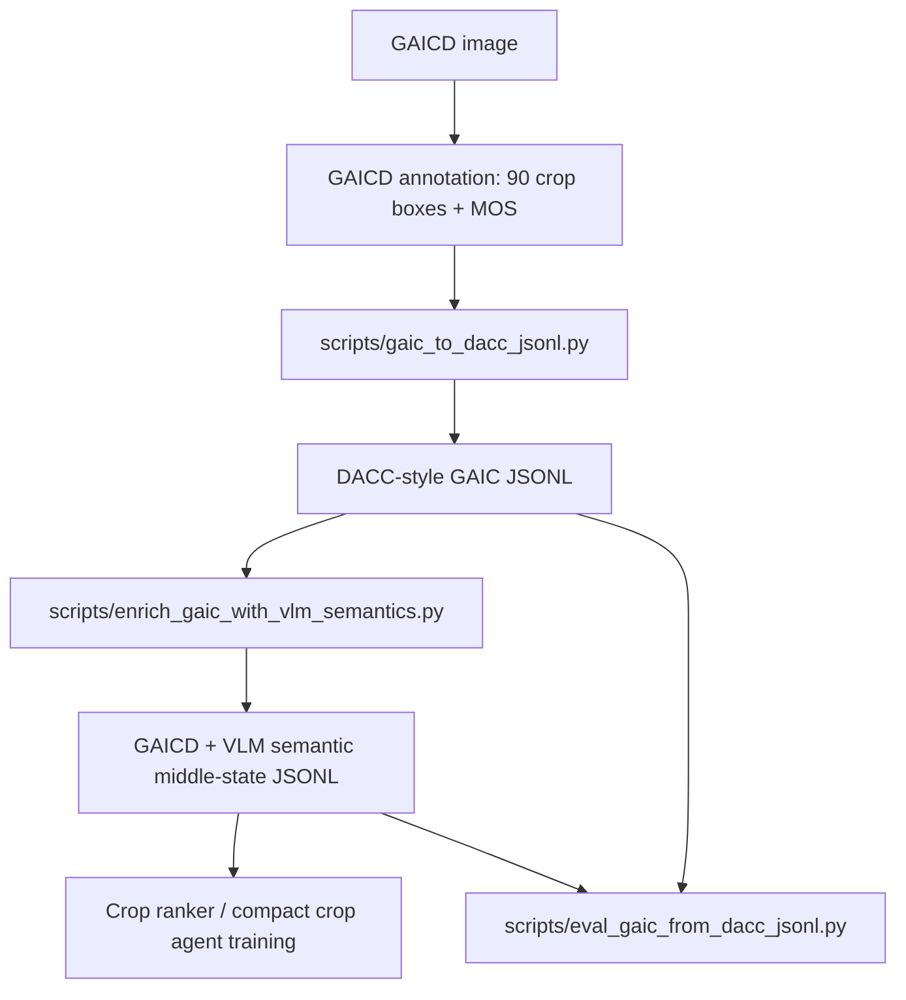

# GAICD + VLM 语义中间态生成说明

本文档对应当前项目里的 GAICD 数据接入与 VLM 语义中间态生成代码。核心原则是：**GAICD 的人工 MOS 裁剪框用于裁剪监督，VLM 只负责生成 caption、主体、关键物体、背景、干扰物、构图意图、动作建议等语义中间态**。不要用 VLM 输出的框覆盖 GAICD 的人工候选框。

## 1. 整体流程



这条线的作用不是重新画框，而是把 GAICD 变成可以训练“可解释构图裁剪模型”的数据：

- `image_path`: 原图路径。
- `candidates`: GAICD 给出的候选裁剪框，每个框有人工 MOS。
- `best_crop`: MOS 最高的 GAICD 裁剪框。
- `caption`: VLM 生成的短英文 caption，目标是 10 个词以内。
- `composition_middle_state`: VLM 生成的主体、关键物体、背景、干扰物、构图意图和动作建议。
- `gaic_supervision`: 记录该样本的裁剪监督来自 GAICD human MOS。

## 2. 输入数据

GAICD 目录需要是如下结构：

```text
/Volumes/shrimp/beauty_dataset/GAIC
├── annotations
│   ├── 211085.txt
│   └── ...
└── images
    ├── train
    │   ├── 211085.jpg
    │   └── ...
    └── test
        └── ...
```

每个 annotation 文件每行 5 列：

```text
x1 y1 x2 y2 MOS
```

当前脚本默认按 GAICD 常见的 `1024x1024` grid anchor 坐标处理，然后按图像真实宽高做 per-axis scaling。原因是部分图片真实尺寸是 `1024x849` 或 `683x1024`，但标注里会出现 `981` 这类 1024 网格坐标。脚本参数 `--coord-mode auto` 会自动处理这一点。

## 3. 生成 GAICD DACC JSONL

运行：

```bash
python scripts/gaic_to_dacc_jsonl.py \
  --gaic-root /Volumes/shrimp/beauty_dataset/GAIC \
  --out-dir data/gaic_dacc/metadata \
  --coord-mode auto
```

输出：

```text
data/gaic_dacc/metadata/train.jsonl
data/gaic_dacc/metadata/test.jsonl
data/gaic_dacc/metadata/summary.json
```

调试时只转少量样本：

```bash
python scripts/gaic_to_dacc_jsonl.py \
  --gaic-root /Volumes/shrimp/beauty_dataset/GAIC \
  --out-dir runs/gaic_debug/metadata \
  --coord-mode auto \
  --max-records 5
```

## 4. 生成 VLM 语义中间态

先用零成本 heuristic 跑通：

```bash
python scripts/enrich_gaic_with_vlm_semantics.py \
  --input-jsonl data/gaic_dacc/metadata/train.jsonl \
  --out-jsonl runs/gaic_semantic_heuristic/train.jsonl \
  --vlm heuristic \
  --max-records 5 \
  --visualize \
  --overwrite
```

启用 `--visualize` 后，会额外保存可视化图片。默认目录由 `--out-jsonl` 自动推导，例如上面的命令会输出到：

```text
runs/gaic_semantic_heuristic/train_vis/
```

也可以手动指定目录和显示的候选框数量：

```bash
python scripts/enrich_gaic_with_vlm_semantics.py \
  --input-jsonl data/gaic_dacc/metadata/train.jsonl \
  --out-jsonl data/gaic_semantic_qwen/train_5.jsonl \
  --vlm qwen \
  --qwen-model qwen3-vl-plus \
  --max-records 5 \
  --visualize \
  --vis-dir data/gaic_semantic_qwen/vis_train_5 \
  --vis-topk 5 \
  --overwrite
```

可视化颜色约定：

- 红框：GAICD 最高 MOS 框，也就是当前 `best_crop`。
- 绿框：GAICD top-k 候选框。
- 蓝/紫/橙/黄框：VLM 返回的主体、关键物体、背景、干扰物 bbox；如果 VLM 没有返回 bbox，则不会画这些语义框。

使用 Qwen3-VL：

```bash
export DASHSCOPE_API_KEY="你的 key"

python scripts/enrich_gaic_with_vlm_semantics.py \
  --input-jsonl data/gaic_dacc/metadata/train.jsonl \
  --out-jsonl data/gaic_semantic_qwen/train.jsonl \
  --vlm qwen \
  --qwen-model qwen3-vl-plus \
  --resume
```

测试集也可以生成中间态，但只能用于评估和分析，不能混入训练：

```bash
python scripts/enrich_gaic_with_vlm_semantics.py \
  --input-jsonl data/gaic_dacc/metadata/test.jsonl \
  --out-jsonl data/gaic_semantic_qwen/test.jsonl \
  --vlm qwen \
  --qwen-model qwen3-vl-plus \
  --resume
```

使用 OpenAI `/v1/responses`：

```bash
export OPENAI_API_KEY="你的 key"

python scripts/enrich_gaic_with_vlm_semantics.py \
  --input-jsonl data/gaic_dacc/metadata/train.jsonl \
  --out-jsonl data/gaic_semantic_openai/train.jsonl \
  --vlm openai \
  --openai-model gpt-4.1-mini \
  --openai-image-detail auto \
  --resume
```

## 5. 输出 JSONL 结构

每一行是一个样本。核心结构如下：

```json
{
  "sample_id": "211085",
  "image_path": "/Volumes/shrimp/beauty_dataset/GAIC/images/train/211085.jpg",
  "image_width": 1024,
  "image_height": 849,
  "target_aspect_ratio": "free",
  "caption": "A concise English image caption",
  "semantic_type": "person_nature",
  "semantic_info": {
    "semantic_type": "person_nature",
    "main_group": "A",
    "reason": "..."
  },
  "vlm_understanding": {
    "caption": "A concise English image caption",
    "main_subject": {
      "name": "person",
      "category": "person",
      "importance": 1.0,
      "bbox_norm": [0.2, 0.1, 0.8, 0.9]
    },
    "key_objects": [],
    "important_background": [],
    "distractors": [],
    "composition_intent": {
      "preserve": ["person"],
      "avoid_cutting": ["head", "hands", "feet"],
      "preferred_subject_position": "left third",
      "initial_issue": "subject_too_centered",
      "suggested_actions": ["place_subject_left_third", "keep_environment"]
    },
    "source": "qwen_dashscope"
  },
  "composition_middle_state": {
    "teacher_role": "semantic_middle_state_only",
    "crop_supervision_source": "gaicd_human_mos",
    "caption": "A concise English image caption",
    "semantic_type": "person_nature",
    "main_subject": {},
    "key_objects": [],
    "important_background": [],
    "distractors": [],
    "composition_intent": {},
    "suggested_action": "place_subject_left_third",
    "initial_issue": "subject_too_centered",
    "gaic_best_crop": [106, 106, 672, 813],
    "gaic_best_score": 4.0,
    "gaic_num_candidates": 90
  },
  "candidates": [
    {
      "candidate_id": "gaic_001",
      "box": [106, 106, 672, 813],
      "source": "gaic_anchor",
      "scores": {
        "final_score": 4.0,
        "mos": 4.0
      },
      "rank": 1,
      "quality_label": "good",
      "gaic_original_box": [106, 128, 672, 981]
    }
  ],
  "best_crop": [106, 106, 672, 813],
  "best_score": 4.0,
  "best_action": "place_subject_left_third",
  "main_issue": "subject_too_centered",
  "gaic_supervision": {
    "source": "GAICD",
    "candidate_scores": "human_mos",
    "best_crop_from": "highest_mos_candidate",
    "coord_mode": "square1024"
  }
}
```

注意：`gaic_original_box` 是 GAICD 原始 1024 网格坐标；`box` 是已经映射到真实图像尺寸并裁剪到图像范围内的训练坐标。

## 6. 评估与自检

检查 JSONL 里的候选框是否能对齐 GAICD MOS 标注：

```bash
python scripts/eval_gaic_from_dacc_jsonl.py \
  --gaic-root /Volumes/shrimp/beauty_dataset/GAIC \
  --jsonl data/gaic_dacc/metadata/test.jsonl \
  --topk 5 \
  --out-json runs/gaic_eval_sanity/test_self_eval.json
```

如果评估的是模型预测结果，只要输出也是 DACC-style JSONL，并把预测框放在 `candidates` 里即可：

```bash
python scripts/eval_gaic_from_dacc_jsonl.py \
  --gaic-root /Volumes/shrimp/beauty_dataset/GAIC \
  --jsonl runs/my_model_predictions/test_predictions.jsonl \
  --topk 5 \
  --score-key pred_score
```

## 7. 训练 ranker baseline

GAICD-only ranker：

```bash
python scripts/train_ranker.py \
  --config configs/ranker_gaic_small.yaml
```

训练完成后可用已有脚本检查分数拟合能力：

```bash
python scripts/eval_ranker.py \
  --jsonl data/gaic_dacc/metadata/test.jsonl \
  --checkpoint runs/gaic_ranker_small/best.pt \
  --config configs/ranker_gaic_small.yaml
```

## 8. 建议实验矩阵

| 实验 | 训练数据 | 语义中间态 | 目的 |
| --- | --- | --- | --- |
| GAIC-only ranker | GAICD train | 不用 | 证明基础 MOS 排序能力 |
| GAIC + VLM semantic ranker | GAICD train | 用 caption/semantic/action | 验证语义中间态是否提升排序 |
| DACC rule + GAIC mix | 自建 DACC + GAICD train | 用 | 同时学习方向性裁剪与人类 MOS |
| Compact crop agent | GAIC/DACC enriched | 用 | 蒸馏到轻量模型，输出 top-k 坐标和原因 |

## 9. 数据泄漏规则

- `images/train` 和对应 annotation 可以用于训练。
- `images/test` 和对应 annotation 只用于评估。
- 可以给 test 生成 VLM 中间态用于解释性分析，但不能把 test 中间态或 test MOS 混入训练。
- 论文实验里要分别报告 GAIC-only、GAIC+semantic、DACC+GAIC 的消融。

## 10. 当前阶段你应该先做什么

1. 重新运行 `gaic_to_dacc_jsonl.py`，确保坐标按真实图像尺寸映射。
2. 用 `heuristic` 跑 5 个样本，确认 JSONL 结构无误。
3. 用 `qwen3-vl-plus` 跑 20 个样本，人工看 caption 和 `composition_middle_state` 是否可用。
4. 再全量跑 train。
5. 训练 `configs/ranker_gaic_small.yaml` 得到 GAICD baseline。
